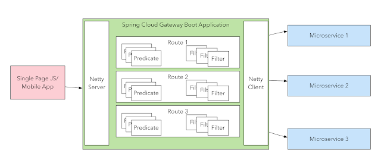

# React SPA's and Direct vs BFF pattern

We already cleared the discussion around now wanting to have the Direct pattern but the BFF instead because scalability and security challenges we
have with doing Direct calls from React to API.

We have the following BFF scenarios:

1. Providing a layer of logic and data abstracting (more like the traditional web app) 
2. Blindly forwarding HTTP requests (akind you are doing on prospect frontend)
3. A mix of both, this is probably most frequently scenario we can think of.

No we have that challenge at 2 to keep DRY and maintainable. 

My suggestion and probably the most standard, scaleable and portable solution is [Spring Cloud Gateway routing handlers](https://www.baeldung.com/spring-cloud-gateway-routing-predicate-factories#anatomy_of_a_predicate), more specifically 
the [Path Route Predicate Factory](2. https://www.baeldung.com/spring-cloud-gateway#6-path-route-predicate-factory) that allows you to programmatically (Fluent API) or declaratively define your path's to your downstream AP's using properties or YAML file.

Take a look at [this example](https://github.com/spring-cloud-samples/spring-cloud-gateway-sample/blob/master/src/main/java/com/example/demogateway/DemogatewayApplication.java), this allows you to have a mix of different kind routes, down-stream based on predicates and embedded api

 
I suggest that we come up with a standard of prefixing downstream path's with /api and embedded logic simply everything else but /api

Please your feedback

